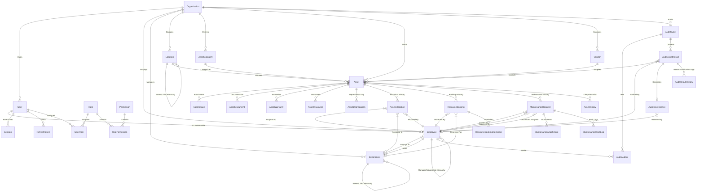

# AssetFlow ERP Database Architecture

This document provides the complete database design, entity relationship definitions, security policies, and performance indexes for **AssetFlow (Enterprise Asset & Resource Management System)**.

---

## 1. Entity Relationship (ER) Diagram

Below is the complete database structure containing 22 normalized entities supporting multi-tenancy, dynamic RBAC, strict audit logs, hierarchical locations, and workflow tracking.



---

## 2. Core Entities & Tables

### 2.1 Multi-Tenant Organization Setup

#### `Organization`
Stores tenant configurations. All transactional and master data points back to this table.
*   `id` (UUID, Primary Key)
*   `name` (String): Business name.
*   `code` (String, Unique): System identifier.
*   `isDeleted` (Boolean): Soft-delete indicator.

#### `Location`
Stores site-building-floor-room hierarchies to avoid free-text location entries.
*   `id` (UUID, Primary Key)
*   `name` (String): Floor number, room number, or site name.
*   `code` (String, Unique): Combined hierarchy code (e.g. `HQ-B1-F2-R12`).
*   `parentId` (UUID, Nullable): References parent `Location.id`.
*   `organizationId` (UUID): Tenant link.

---

### 2.2 Authentication & User Security

#### `User`
Primary authorization account. Enforces Employee-only logins.
*   `id` (UUID, Primary Key)
*   `email` (String, Unique): Valid corporate email.
*   `passwordHash` (String): Bcrypt/Argon2 password hash.
*   `emailVerified` (Boolean): Verification status.
*   `status` (Enum: `ACTIVE`, `SUSPENDED`, `DEACTIVATED`)
*   `lastLoginAt` (DateTime, Nullable): Tracks active usage.
*   `loginAttempts` (Int): Sequential failed attempts.
*   `lockoutUntil` (DateTime, Nullable): Brute-force lockout expiration timestamp.
*   `employeeId` (UUID, Unique): Mandatory link to the `Employee` directory record (enforces Employee-only accounts).
*   `organizationId` (UUID)

#### `Session`
Manages active user logins. Supports session termination across devices.
*   `id` (UUID, Primary Key)
*   `userId` (UUID): Links to `User.id`.
*   `ipAddress` (String): Remote client IP.
*   `userAgent` (String): Browser fingerprint.
*   `expiresAt` (DateTime): Expiry validation.
*   `revokedAt` (DateTime, Nullable)

#### `RefreshToken`
JWT refresh rotations to prevent authentication leakage.
*   `id` (UUID, Primary Key)
*   `userId` (UUID)
*   `token` (String, Unique)
*   `expiresAt` (DateTime)

---

### 2.3 Role-Based Access Control (RBAC)

#### `Role`
Stores dynamic roles.
*   `id` (UUID, Primary Key)
*   `name` (String, Unique): Role code (e.g., `ASSET_MANAGER`).
*   `description` (String, Nullable)

#### `Permission`
Stores system action permissions.
*   `id` (UUID, Primary Key)
*   `name` (String, Unique): Permission code (e.g., `asset:allocate`).

#### `RolePermission`
Mapping table for roles and their actions.
*   `roleId` (UUID)
*   `permissionId` (UUID)
*   *Composite Unique Index:* `[roleId, permissionId]`

---

### 2.4 Human Resource Directory

#### `Employee`
HR directory metadata. Tracks corporate hierarchy.
*   `id` (UUID, Primary Key)
*   `name` (String)
*   `email` (String, Unique)
*   `phone` (String, Nullable)
*   `status` (Enum: `ACTIVE`, `LEAVE`, `TERMINATED`)
*   `departmentId` (UUID, Nullable): Links to Department.
*   `managerId` (UUID, Nullable): Self-reference to their Employee supervisor.
*   `organizationId` (UUID)

#### `Department`
Departmental ownership definitions.
*   `id` (UUID, Primary Key)
*   `name` (String)
*   `code` (String, Unique)
*   `path` (String, Nullable): Materialized search path (e.g. `1/14/52`) for rapid tree lookups.
*   `headId` (UUID, Unique, Nullable): Employee leading the department.
*   `parentId` (UUID, Nullable): Parent department self-reference.

---

### 2.5 Asset Registry & Lifecycle

#### `AssetCategory`
*   `id` (UUID, Primary Key)
*   `name` (String, Unique)
*   `customFieldSchema` (JSON, Nullable): Meta-schema defining category-specific inputs.

#### `Asset`
*   `id` (UUID, Primary Key)
*   `name` (String)
*   `assetTag` (String, Unique): Internal identifier (e.g. `AF-0001`).
*   `serialNumber` (String, Unique, Nullable)
*   `barcode` (String, Unique, Nullable)
*   `qrCode` (String, Unique, Nullable)
*   `acquisitionCost` (Decimal, Nullable): Cost validation.
*   `condition` (Enum: `NEW`, `EXCELLENT`, `GOOD`, `FAIR`, `POOR`, `DAMAGED`)
*   `status` (Enum: `AVAILABLE`, `ALLOCATED`, `RESERVED`, `UNDER_MAINTENANCE`, `LOST`, `RETIRED`, `DISPOSED`)
*   `locationId` (UUID): Reference to the Location hierarchy table.
*   `customFieldValues` (JSON, Nullable): Stores custom attribute values mapping to the Category schema.
*   `expectedLifetimeMonths` (Int, Nullable): Lifespan tracking.
*   `expectedRetirementDate` (DateTime, Nullable)

#### `AssetHistory` (Asset Lifecycle Log)
Auditable, historical timeline of asset changes over time.
*   `id` (UUID, Primary Key)
*   `assetId` (UUID): Reference to Asset.
*   `status` (AssetStatus)
*   `condition` (Condition)
*   `locationId` (UUID): Location reference.
*   `departmentId` (UUID, Nullable): Department reference.
*   `changedById` (UUID): User who committed the change.
*   `notes` (String, Nullable)

---

### 2.6 Asset Allocations & Transfers

#### `AssetAllocation`
Transactional history log of asset assignments.
*   `id` (UUID, Primary Key)
*   `assetId` (UUID): *onDelete: Restrict* (retains history).
*   `employeeId` (UUID, Nullable): Employee holding the asset.
*   `departmentId` (UUID, Nullable): Department holding the asset.
*   `allocatedById` (UUID): Allocating manager.
*   `status` (Enum: `ACTIVE`, `RETURNED`, `TRANSFERRED`)
*   `checkoutCondition` (Condition)
*   `checkinCondition` (Condition, Nullable)
*   `expectedReturnDate` (DateTime, Nullable)
*   `actualReturnDate` (DateTime, Nullable)

#### `AssetTransferRequest`
Approval workflow routing transfers between employees.
*   `id` (UUID, Primary Key)
*   `assetId` (UUID)
*   `requestorId` (UUID): Employee requesting the asset.
*   `targetEmployeeId` (UUID, Nullable)
*   `targetDepartmentId` (UUID, Nullable)
*   `status` (Enum: `PENDING`, `APPROVED`, `REJECTED`, `CANCELLED`)
*   `actionedById` (UUID, Nullable): Approving manager.
*   `rejectionReason` (String, Nullable)

---

### 2.7 Resource Bookings

#### `ResourceBooking`
Reservations on bookable assets (e.g. rooms).
*   `id` (UUID, Primary Key)
*   `assetId` (UUID): *onDelete: Restrict*.
*   `bookedById` (UUID)
*   `startTime` (DateTime)
*   `endTime` (DateTime)
*   `status` (Enum: `UPCOMING`, `ONGOING`, `COMPLETED`, `CANCELLED`)
*   `recurrenceRule` (String, Nullable): RFC 5545 RRULE string.
*   `seriesId` (String, Nullable): Parent recurring series ID.

#### `ResourceBookingReminder`
Schedules reminders for booking occurrences.
*   `id` (UUID, Primary Key)
*   `bookingId` (UUID): Parent booking.
*   `reminderTime` (DateTime)
*   `isSent` (Boolean)

---

### 2.8 Maintenance Management

#### `MaintenanceRequest`
Repairs and tickets.
*   `id` (UUID, Primary Key)
*   `assetId` (UUID): *onDelete: Restrict*.
*   `raisedById` (UUID)
*   `priority` (Enum: `LOW`, `MEDIUM`, `HIGH`, `CRITICAL`)
*   `status` (Enum: `PENDING`, `APPROVED`, `REJECTED`, `TECHNICIAN_ASSIGNED`, `IN_PROGRESS`, `RESOLVED`)
*   `approvedById` (UUID, Nullable)
*   `technicianId` (UUID, Nullable): Staff technician.
*   `externalTechnician` (String, Nullable)
*   `estimatedCost` (Decimal, Nullable)
*   `actualCost` (Decimal, Nullable)

#### `MaintenanceAttachment`
Links multiple photos, receipts, or manuals to a repair ticket.
*   `id` (UUID, Primary Key)
*   `maintenanceRequestId` (UUID)
*   `url` (String)

#### `MaintenanceWorkLog`
Logs labor hours and status changes for technicians.
*   `id` (UUID, Primary Key)
*   `maintenanceRequestId` (UUID)
*   `technicianId` (UUID)
*   `laborHours` (Decimal)
*   `notes` (String, Nullable)

---

### 2.9 Financial & Compliance Normalization

#### `Vendor`
Vendor/Supplier details.
*   `id` (UUID, Primary Key)
*   `name` (String)
*   `contactEmail` (String, Nullable)

#### `AssetWarranty`
*   `id` (UUID, Primary Key)
*   `assetId` (UUID)
*   `warrantyEndDate` (DateTime)

#### `AssetInsurance`
*   `id` (UUID, Primary Key)
*   `assetId` (UUID)
*   `coverageAmount` (Decimal)

#### `AssetDepreciation`
Depreciation scheduling mapping to standard accounting guidelines.
*   `id` (UUID, Primary Key)
*   `assetId` (UUID)
*   `method` (Enum: `STRAIGHT_LINE`, `DECLINING_BALANCE`, `UNITS_OF_PRODUCTION`)
*   `salvageValue` (Decimal)
*   `usefulLifeMonths` (Int)
*   `currentBookValue` (Decimal)

---

### 2.10 Messaging & System Queues

#### `EmailQueue`
Outbox queue for background email deliveries.
*   `id` (UUID, Primary Key)
*   `recipient` (String): Email address.
*   `subject` (String)
*   `body` (String)
*   `status` (Enum: `PENDING`, `SENT`, `FAILED`)
*   `retryCount` (Int)
*   `maxRetries` (Int)
*   `lastError` (String, Nullable)

#### `NotificationPreference`
Opt-in settings for delivery channels (Email, Push, In-App).
*   `id` (UUID, Primary Key)
*   `userId` (UUID)
*   `notificationType` (NotificationType)
*   `channelEmail` (Boolean)
*   `channelPush` (Boolean)
*   `channelInApp` (Boolean)
*   *Composite Unique Index:* `[userId, notificationType]`

---

## 3. SQL Data Integrity Constraints

These checks are implemented at the database engine level (PostgreSQL migrations) to ensure strict data validation:

### 3.1 Business Rules Check Constraints
```sql
-- 1. Enforce that an allocation goes to either an Employee OR a Department (never both, never neither)
ALTER TABLE "AssetAllocation" 
  ADD CONSTRAINT ck_allocation_target 
  CHECK (
    (employeeId IS NOT NULL AND departmentId IS NULL) OR 
    (employeeId IS NULL AND departmentId IS NOT NULL)
  );

-- 2. Enforce that a transfer goes to either an Employee OR a Department
ALTER TABLE "AssetTransferRequest" 
  ADD CONSTRAINT ck_transfer_target 
  CHECK (
    (targetEmployeeId IS NOT NULL AND targetDepartmentId IS NULL) OR 
    (targetEmployeeId IS NULL AND targetDepartmentId IS NOT NULL)
  );

-- 3. Enforce that start dates occur before end dates
ALTER TABLE "ResourceBooking" 
  ADD CONSTRAINT ck_booking_time_integrity 
  CHECK (endTime > startTime);

ALTER TABLE "AssetAllocation" 
  ADD CONSTRAINT ck_allocation_time_integrity 
  CHECK (actualReturnDate IS NULL OR actualReturnDate >= allocatedAt);

ALTER TABLE "AuditCycle" 
  ADD CONSTRAINT ck_audit_time_integrity 
  CHECK (endDate >= startDate);
```

### 3.2 Dynamic Active Allocation Uniqueness
To prevent an asset from having multiple concurrent allocations, we enforce a partial unique index on active statuses:
```sql
CREATE UNIQUE INDEX "AssetAllocation_active_asset_unique" 
  ON "AssetAllocation"("assetId") 
  WHERE status = 'ACTIVE';
```

### 3.3 Resource Overlap Prevention
To block overlapping booking time frames at the engine level for bookable assets, we enforce a PostgreSQL exclusion constraint:
```sql
CREATE EXTENSION IF NOT EXISTS btree_gist;

ALTER TABLE "ResourceBooking" 
  ADD CONSTRAINT ck_no_overlapping_bookings 
  EXCLUDE USING gist (
    "assetId" WITH =,
    tsrange("startTime", "endTime") WITH &&
  )
  WHERE ("status" != 'CANCELLED');
```
