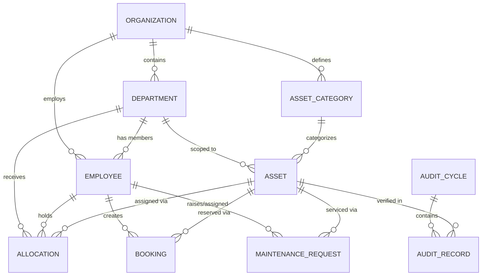
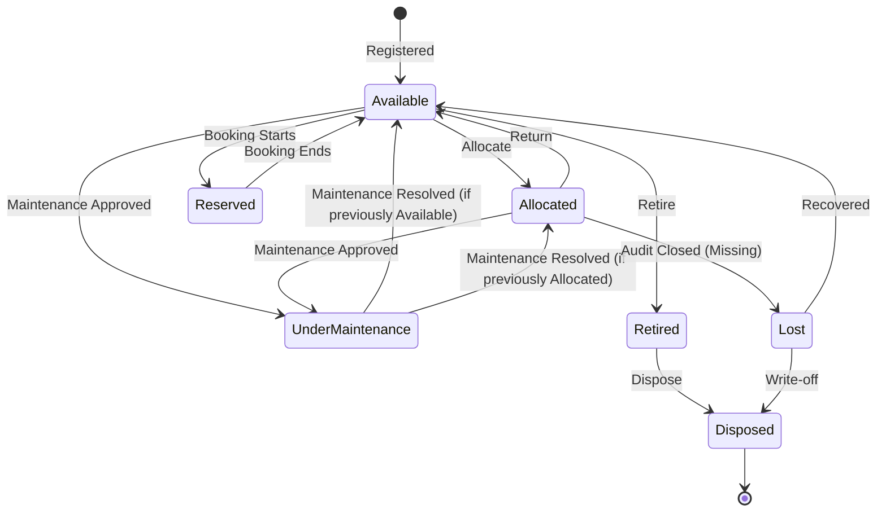
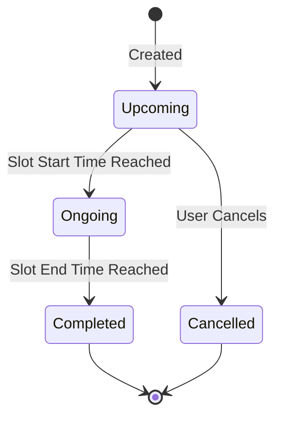
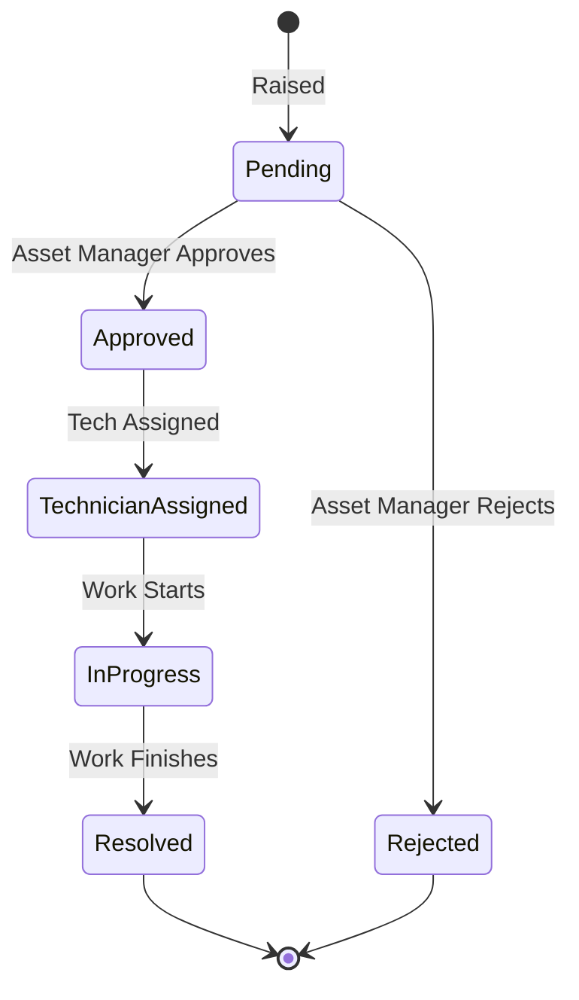
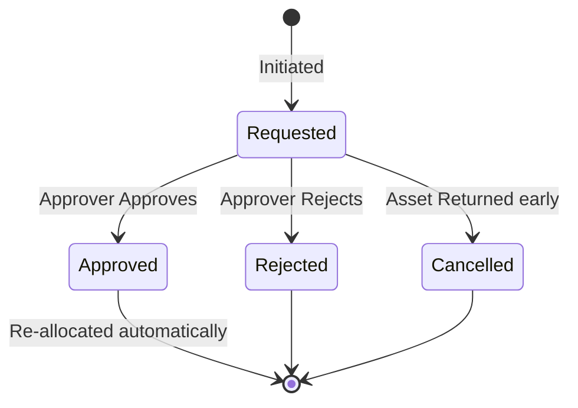
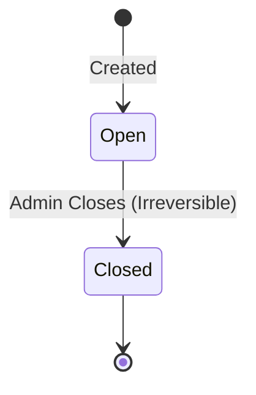

# 01. Domain Model

> **Version:** 1.1
> **Status:** Draft — Pending Approval  
> **Source:** Derived strictly from `00_PRD.md` v1.1.

This document models the business domain for AssetFlow using Domain-Driven Design (DDD) principles. It focuses strictly on the business aggregates, entities, relationships, invariants, and domain events, without prescribing database schemas or implementation details.

---

## 1. Bounded Contexts

The AssetFlow domain can be logically divided into the following Bounded Contexts:

1. **Organization Context:** Manages the structural hierarchy of the enterprise (Departments, Employees, Categories).
2. **Asset Lifecycle Context:** Manages the core physical assets, their statuses, and tracking.
3. **Custody & Transfer Context:** Manages who holds what (Allocations, Transfer Requests, Returns).
4. **Booking Context:** Manages time-slot reservations for shared resources.
5. **Maintenance Context:** Manages the repair and servicing workflow for assets.
6. **Audit Context:** Manages structured verification cycles and discrepancy detection.

---

## 2. Aggregates and Entities

Aggregates are clusters of domain objects that can be treated as a single unit. Each Aggregate has a Root Entity that ensures the consistency of changes within the aggregate.

### 2.1 Organization Aggregate
* **Aggregate Root:** Organization
* **Child Entities:** Department, Employee, Asset Category
* **Value Objects:** DepartmentId, EmployeeId, EmailAddress
* **Internal Invariants:** Department Names must be unique. Employee Emails must be unique. Category Names must be unique.
* **Aggregate Responsibilities:** Defines the boundaries of the system. Contains all departments, employees, and asset categorizations. Acts as the master data source.
* **Allowed External References:** None. (This is the top of the dependency chain).
* **Aggregate Transactions:** Creating a department, promoting an employee role.
* **Consistency Boundary:** Organization-wide uniqueness constraints.

### 2.2 Asset Aggregate
* **Aggregate Root:** Asset
* **Child Entities:** None
* **Value Objects:** AssetId, AssetTag, Money (Cost), Location, Condition
* **Internal Invariants:** Asset Tag is globally unique. Serial Number is unique if present. Must exist in exactly one lifecycle state.
* **Aggregate Responsibilities:** The central entity tracking physical items. Maintains its own lifecycle state and physical properties.
* **Allowed External References:** CategoryId (from Organization), DepartmentId (for scoping).
* **Aggregate Transactions:** Registering an asset, changing lifecycle state (Available ↔ Under Maintenance).
* **Consistency Boundary:** Asset properties and lifecycle state integrity.

### 2.3 Custody Aggregate
* **Aggregate Root:** Allocation
* **Child Entities:** Transfer Request
* **Value Objects:** ExpectedReturnDate, ConditionNotes, DateRange
* **Internal Invariants:** Cannot allocate an already-allocated asset.
* **Aggregate Responsibilities:** Manages the assignment of assets to employees or departments. Tracks active custody and historical returns.
* **Allowed External References:** AssetId, EmployeeId, DepartmentId.
* **Aggregate Transactions:** Allocating an asset, returning an asset, approving a transfer request.
* **Consistency Boundary:** Custody timeline for a specific asset.

### 2.4 Booking Aggregate
* **Aggregate Root:** Booking
* **Child Entities:** None
* **Value Objects:** BookingId, TimeSlot
* **Internal Invariants:** No overlapping time slots for the same bookable asset.
* **Aggregate Responsibilities:** Manages time-based reservations of bookable assets.
* **Allowed External References:** AssetId, EmployeeId.
* **Aggregate Transactions:** Creating a booking, cancelling a booking.
* **Consistency Boundary:** The timeline schedule of a single bookable asset.

### 2.5 Maintenance Aggregate
* **Aggregate Root:** Maintenance Request
* **Child Entities:** None
* **Value Objects:** MaintenancePriority, ConditionNotes
* **Internal Invariants:** Approval is required before work starts (Asset goes Under Maintenance).
* **Aggregate Responsibilities:** Manages the approval and execution of asset repairs.
* **Allowed External References:** AssetId, EmployeeId (Requester), EmployeeId (Technician).
* **Aggregate Transactions:** Raising request, approving/rejecting, resolving.
* **Consistency Boundary:** The lifecycle of a single repair request.

### 2.6 Audit Aggregate
* **Aggregate Root:** Audit Cycle
* **Child Entities:** Audit Record (per-asset verification), Discrepancy Report
* **Value Objects:** AuditScope, DateRange
* **Internal Invariants:** Cycle closure is irreversible.
* **Aggregate Responsibilities:** Manages the verification of assets within a specific scope and time period.
* **Allowed External References:** DepartmentId, Location, EmployeeId (Auditors), AssetId.
* **Aggregate Transactions:** Opening cycle, recording verification, closing cycle.
* **Consistency Boundary:** The snapshot of asset verification states during the cycle.

---

## 3. Value Objects

Value Objects are immutable objects that describe characteristics or attributes but have no conceptual identity.

* **AssetTag:**
  * *Purpose:* Identifies an asset visually and systematically.
  * *Validation:* Must match format `AF-XXXX` (or extended).
  * *Immutability:* Cannot be changed once assigned.
  * *Business Meaning:* The primary physical label on the item.
* **EmailAddress:**
  * *Purpose:* Identifies a user's login and contact point.
  * *Validation:* Standard regex for valid email structure.
  * *Immutability:* Replaced entirely if changed.
  * *Business Meaning:* Communication and identity channel.
* **Money (Acquisition Cost):**
  * *Purpose:* Represents the purchase value for reporting.
  * *Validation:* Must be non-negative.
  * *Immutability:* Replaced, not mutated.
  * *Business Meaning:* Used for ranking, explicitly not linked to accounting.
* **Location:**
  * *Purpose:* Describes where an asset is physically kept.
  * *Validation:* Non-empty string.
  * *Immutability:* Replaced upon move.
  * *Business Meaning:* Physical whereabouts for audits.
* **TimeSlot:**
  * *Purpose:* Defines a booking duration.
  * *Validation:* Start time must precede End time. Must be in the future for creation.
  * *Immutability:* Immutable. A reschedule creates a new TimeSlot.
  * *Business Meaning:* The exact window a resource is reserved.
* **DateRange:**
  * *Purpose:* Defines the active period of an Audit Cycle or Report.
  * *Validation:* Start date <= End date.
  * *Immutability:* Immutable.
  * *Business Meaning:* The temporal scope of an event.
* **Priority (MaintenancePriority):**
  * *Purpose:* Urgency of a maintenance request.
  * *Validation:* Enum (Low, Medium, High, Critical).
  * *Immutability:* Can be updated by replacing the value.
  * *Business Meaning:* Drives technician SLA and attention.
* **Condition:**
  * *Purpose:* Physical state of an asset.
  * *Validation:* Enum/String descriptor.
  * *Immutability:* Immutable snapshot.
  * *Business Meaning:* Tracked over time to assess depreciation/damage.
* **ConditionNotes:**
  * *Purpose:* Free-text description of asset state at return or maintenance.
  * *Validation:* Text.
  * *Immutability:* Immutable once recorded.
  * *Business Meaning:* Accountability for asset degradation.
* **ExpectedReturnDate:**
  * *Purpose:* Target date for allocation return.
  * *Validation:* Must be in the future when set.
  * *Immutability:* Replaced if extended.
  * *Business Meaning:* Triggers overdue alerts if passed.
* **DepartmentId, EmployeeId, AssetId, BookingId:**
  * *Purpose:* System identifiers for external referencing between aggregates.
  * *Validation:* Valid UUID/ObjectID format.
  * *Immutability:* Strictly immutable.
  * *Business Meaning:* Cross-aggregate linkages.
* **AuditScope:**
  * *Purpose:* Defines the boundaries of an audit.
  * *Validation:* Must reference a valid Department or Location.
  * *Immutability:* Immutable once cycle is open.
  * *Business Meaning:* Determines which assets are expected in the checklist.

---

## 4. Domain Events

Domain events represent significant business occurrences that trigger side effects (such as notifications or state changes) across bounded contexts.

| Domain Event | Trigger | Handled By (Side Effects) |
|--------------|---------|---------------------------|
| `AssetAllocated` | Allocation created | Notifications, Activity Log |
| `AssetReturned` | Asset check-in completed | Asset (Status → Available), Pending Transfers Cancelled |
| `TransferRequested` | Transfer Request created | Notifications |
| `TransferApproved` | Transfer Request approved | Allocation (New Allocation Created), Notifications |
| `BookingConfirmed` | Booking created without overlap | Notifications, Reminder Scheduled |
| `BookingCancelled` | Booking cancelled by user | Notifications, Time slot freed |
| `MaintenanceRequested` | Maintenance Request raised | Notifications |
| `MaintenanceApproved` | Maintenance Request approved | Asset (Status → Under Maintenance), Notifications |
| `MaintenanceResolved` | Maintenance completed | Asset (Status → Previous State), Notifications |
| `AllocationOverdue` | Expected Return Date passed | Dashboard, Notifications |
| `AuditCycleClosed` | Audit Cycle closed by Admin | Asset (Missing items → Lost), Discrepancy Report Generated |

---

## 5. Domain Invariants

Invariants are business rules that must never be compromised. (Sourced strictly from `00_PRD.md`)

1. **No Double-Allocation:** An asset with an Active Allocation cannot be allocated again. Direct re-allocation is blocked.
2. **No Booking Overlaps:** A bookable asset cannot have two Active Bookings where `(new_start < existing_end AND new_end > existing_start)`. Adjacent bookings (end == start) are permitted.
3. **Role Segregation:** Employees cannot elevate their own roles. Role promotions (to Admin, Asset Manager, or Department Head) are exclusively performed by Admins.
4. **Maintenance Pre-requisite:** An asset cannot transition to "Under Maintenance" without an explicitly Approved Maintenance Request.
5. **Audit Immutability:** Once an Audit Cycle is closed, it is locked permanently. No further modifications can be made.
6. **Terminal State:** An asset marked as "Disposed" cannot transition to any other lifecycle state.
7. **Identity Uniqueness:** Asset Tags, Serial Numbers (if provided), Employee Emails, Department Names, and Category Names must be globally unique.
8. **Single State Validity:** An asset must exist in exactly one lifecycle state (Available, Allocated, Reserved, Under Maintenance, Lost, Retired, Disposed) at any given moment.
9. **History Immutability:** Allocation history, maintenance history, and audit history records are append-only and cannot be altered or deleted.

---

## 6. State Ownership & Relationships

For every important state transition, this matrix defines the business state ownership.

| State Transition | Initiated By | Owner (Accountable) | Approver | Automatic Actions | Generated Events | Generated Notifications |
|------------------|--------------|---------------------|----------|-------------------|------------------|-------------------------|
| Available → Allocated | Asset Manager | Asset Manager | System | Create Allocation record | `AssetAllocated` | Assignee alerted |
| Allocated → Available (Return) | Employee | Asset Manager | Asset Manager | Close Allocation, Cancel pending transfers | `AssetReturned` | Asset Manager alerted |
| Available/Allocated → Under Maintenance | Any User | Asset Manager | Asset Manager | Update Asset status, record previous state | `MaintenanceApproved` | Requester alerted |
| Under Maintenance → Available/Allocated | Technician | Asset Manager | System | Revert to previous status, log history | `MaintenanceResolved` | Asset Manager alerted |
| Open → Closed (Audit Cycle) | Admin | Admin | System | Missing items → Lost, generate report, lock cycle | `AuditCycleClosed` | Auditors & Admin alerted |
| Requested → Approved (Transfer) | Any User | Approver (Asset Mgr/Dept Head) | Approver | Close old Allocation, create new Allocation | `TransferApproved` | Requester, From/To users alerted |

---

## 7. Entity Relationship Model

This model illustrates the cardinality and dependencies between domain entities.

### Relationship Definitions

* **Department ||--o{ Employee:**
  * *Ownership:* Organization owns Department. Department references Employees.
  * *Cardinality:* 1 to Many.
  * *Navigation:* Department → Employees.
  * *Dependency:* Employee must belong to a Department.
  * *Lifecycle:* Deactivating a Department does not delete Employees.
  * *Business Responsibility:* Defines role boundaries (e.g. Dept Head visibility).

* **Employee ||--o{ Allocation:**
  * *Ownership:* Custody Aggregate owns Allocation.
  * *Cardinality:* 1 to Many.
  * *Navigation:* Employee → Allocations.
  * *Dependency:* Allocation must reference an active Employee or Department.
  * *Lifecycle:* Deactivating Employee preserves historical Allocations.
  * *Business Responsibility:* Defines physical custody of assets.

* **Asset ||--o{ Allocation/Booking/MaintenanceRequest:**
  * *Ownership:* Respective Aggregates own their transactions, referencing Asset.
  * *Cardinality:* 1 to Many (History). Only 1 active allocation at a time.
  * *Navigation:* Asset ↔ Transactions.
  * *Dependency:* Transaction cannot exist without an Asset.
  * *Lifecycle:* Retiring an asset preserves its transactional history.
  * *Business Responsibility:* Tracks the full operational lifecycle of physical goods.

* **AuditCycle ||--o{ AuditRecord:**
  * *Ownership:* AuditCycle owns AuditRecords (Composition).
  * *Cardinality:* 1 to Many.
  * *Navigation:* AuditCycle → AuditRecords.
  * *Dependency:* AuditRecord cannot exist outside a cycle.
  * *Lifecycle:* Locked together when cycle is closed.
  * *Business Responsibility:* Point-in-time snapshot of verification.

---

## 8. State Machines

### 8.1 Asset Lifecycle

### 8.2 Booking Lifecycle

### 8.3 Maintenance Lifecycle

### 8.4 Transfer Lifecycle

### 8.5 Audit Lifecycle

---

## 9. Domain Services

Domain Services encapsulate business logic that doesn't naturally fit within a single entity.

* **Allocation Service:**
  * *Purpose:* Orchestrates the assignment of assets.
  * *Responsibilities:* Validates availability, creates Allocation, updates Asset status.
  * *Inputs:* AssetId, TargetId (Employee/Dept), ExpectedReturnDate.
  * *Outputs:* Allocation Record, Domain Event.
  * *Business Rules:* Prevents double-allocation.
  * *Dependencies:* AssetRepository, EmployeeRepository.

* **Booking Conflict Service:**
  * *Purpose:* Validates time-slot availability.
  * *Responsibilities:* Checks new TimeSlot against existing overlapping bookings.
  * *Inputs:* AssetId, TimeSlot.
  * *Outputs:* Boolean (IsAvailable).
  * *Business Rules:* Overlap formula logic.
  * *Dependencies:* BookingRepository.

* **Lifecycle Service:**
  * *Purpose:* Safely transitions asset states.
  * *Responsibilities:* Ensures state transitions are valid per the state machine.
  * *Inputs:* AssetId, TargetState.
  * *Outputs:* Updated Asset.
  * *Business Rules:* Validates allowed transitions (e.g. Cannot maintain a disposed asset).
  * *Dependencies:* AssetRepository.

* **Transfer Service:**
  * *Purpose:* Manages custody handover.
  * *Responsibilities:* Evaluates approval chains, closes old allocation, creates new one.
  * *Inputs:* TransferRequestId.
  * *Outputs:* Resulting Allocations.
  * *Business Rules:* Auto-cancels if asset returned before approval.
  * *Dependencies:* AllocationRepository.

* **Maintenance Approval Service:**
  * *Purpose:* Gates repair work.
  * *Responsibilities:* Changes maintenance status and orchestrates Asset status change.
  * *Inputs:* MaintenanceRequestId, Decision.
  * *Outputs:* Status change.
  * *Business Rules:* Updates asset to UnderMaintenance upon approval.
  * *Dependencies:* AssetRepository, MaintenanceRepository.

* **Audit Service:**
  * *Purpose:* Executes verification cycles.
  * *Responsibilities:* Generates checklists, computes discrepancies, applies mass status updates on closure.
  * *Inputs:* AuditCycle parameters / Closure command.
  * *Outputs:* Discrepancy Report, Domain Events.
  * *Business Rules:* Closure is irreversible and forces Missing assets to Lost.
  * *Dependencies:* AssetRepository, AuditRepository.

* **Notification Service:**
  * *Purpose:* Routes system events to users.
  * *Responsibilities:* Evaluates Priority Model, determines recipients.
  * *Inputs:* Domain Events.
  * *Outputs:* Persisted Notifications.
  * *Business Rules:* High/Critical priority handled immediately.
  * *Dependencies:* EmployeeRepository.

* **Role Assignment Service:**
  * *Purpose:* Enforces RBAC boundaries during promotions.
  * *Responsibilities:* Upgrades employee permissions.
  * *Inputs:* EmployeeId, NewRole.
  * *Outputs:* Updated Employee.
  * *Business Rules:* Only Admin can execute.
  * *Dependencies:* Organization Context.

---

## 10. Domain Policies

Policies encapsulate business rules and conditions.

* **Allocation Policy:**
  * *Intent:* Prevent double custody.
  * *Validation Rules:* Asset must be "Available". Target must be active.
  * *Failure Conditions:* Asset is Allocated/Under Maintenance.
  * *Side Effects:* Triggers Conflict Service.

* **Booking Policy:**
  * *Intent:* Ensure fair resource usage.
  * *Validation Rules:* Asset must be "Shared/Bookable". No overlaps.
  * *Failure Conditions:* Overlap detected. Asset in maintenance.
  * *Side Effects:* None (Read-only validation).

* **Lifecycle Policy:**
  * *Intent:* Maintain physical tracking integrity.
  * *Validation Rules:* Must follow valid state transitions.
  * *Failure Conditions:* Illegal transition (e.g., Disposed → Allocated).
  * *Side Effects:* Generates Activity Log.

* **Transfer Policy:**
  * *Intent:* Ensure authorized handover.
  * *Validation Rules:* Asset must be currently allocated.
  * *Failure Conditions:* Asset is Available.
  * *Side Effects:* Creates Transfer Request.

* **Maintenance Policy:**
  * *Intent:* Control repair costs and visibility.
  * *Validation Rules:* Request requires Priority and Issue Description.
  * *Failure Conditions:* Asset is Retired/Disposed.
  * *Side Effects:* Halts normal allocation while under maintenance.

* **Audit Policy:**
  * *Intent:* Ensure compliance and physical presence.
  * *Validation Rules:* Scope must be defined. All items must have verification status before close.
  * *Failure Conditions:* Incomplete verifications at closure attempt.
  * *Side Effects:* Mutates mass asset statuses.

* **Role Assignment Policy:**
  * *Intent:* Prevent self-elevation.
  * *Validation Rules:* Initiator must be Admin.
  * *Failure Conditions:* Initiator is Employee/Manager.
  * *Side Effects:* Invalidates target user's current session tokens.

* **Notification Policy:**
  * *Intent:* Ensure timely awareness.
  * *Validation Rules:* Priority determines delivery urgency.
  * *Failure Conditions:* None (best-effort delivery).
  * *Side Effects:* Pushes alerts to Dashboard.

---

## 11. Specifications

Specifications are predicate objects used to test if a domain object satisfies a certain business criteria.

* **CanAllocateSpecification:**
  * *Preconditions:* Asset exists. Target exists.
  * *Validation Logic:* `Asset.Status == Available AND Target.Status == Active`.
  * *Failure Reasons:* "Asset is already allocated" or "Target is inactive."
  * *Business Outcome:* Permits Allocation Service to proceed.

* **CanBookSpecification:**
  * *Preconditions:* Asset exists.
  * *Validation Logic:* `Asset.IsBookable == True AND Asset.Status == Available AND BookingConflictService.IsAvailable(TimeSlot)`.
  * *Failure Reasons:* "Resource is not bookable" or "Time slot overlaps."
  * *Business Outcome:* Permits booking confirmation.

* **CanTransferSpecification:**
  * *Preconditions:* Asset exists.
  * *Validation Logic:* `Asset.Status == Allocated AND Asset.CurrentHolder != Target`.
  * *Failure Reasons:* "Asset is not currently allocated."
  * *Business Outcome:* Allows transfer request submission.

* **CanMaintainSpecification:**
  * *Preconditions:* Asset exists.
  * *Validation Logic:* `Asset.Status != Disposed AND Asset.Status != Retired`.
  * *Failure Reasons:* "Cannot maintain disposed/retired assets."
  * *Business Outcome:* Allows maintenance request creation.

* **CanCloseAuditSpecification:**
  * *Preconditions:* Audit Cycle is Open.
  * *Validation Logic:* `ForAll(AuditRecords, record => record.Status != Pending)`.
  * *Failure Reasons:* "Not all assets in scope have been verified."
  * *Business Outcome:* Unlocks irreversible closure process.

* **CanDisposeAssetSpecification:**
  * *Preconditions:* Asset exists.
  * *Validation Logic:* `Asset.Status == Retired OR Asset.Status == Lost`.
  * *Failure Reasons:* "Asset must be retired or lost before disposal."
  * *Business Outcome:* Allows terminal state transition.

---

## 12. Domain Commands

Commands represent explicit user intentions that mutate state.

* **RegisterAsset:** (Actor: Asset Manager) → Validates uniqueness → Emits `AssetRegistered`.
* **AllocateAsset:** (Actor: Asset Manager) → Validates CanAllocate → Emits `AssetAllocated`.
* **ReturnAsset:** (Actor: Employee/Manager) → Captures notes → Emits `AssetReturned`.
* **CreateTransferRequest:** (Actor: Any) → Validates CanTransfer → Emits `TransferRequested`.
* **ApproveTransfer:** (Actor: Manager/Dept Head) → Reallocates → Emits `TransferApproved`.
* **BookResource:** (Actor: Any) → Validates CanBook → Emits `BookingConfirmed`.
* **CancelBooking:** (Actor: Booker) → Frees slot → Emits `BookingCancelled`.
* **RaiseMaintenanceRequest:** (Actor: Any) → Validates CanMaintain → Emits `MaintenanceRequested`.
* **ApproveMaintenance:** (Actor: Asset Manager) → Updates Asset state → Emits `MaintenanceApproved`.
* **ResolveMaintenance:** (Actor: Technician) → Reverts Asset state → Emits `MaintenanceResolved`.
* **CreateAuditCycle:** (Actor: Admin) → Generates checklist → Emits `AuditCycleOpened`.
* **CloseAuditCycle:** (Actor: Admin) → Validates CanCloseAudit → Emits `AuditCycleClosed`.
* **PromoteEmployee:** (Actor: Admin) → Applies Role Policy → Emits `RolePromoted`.
* **DeactivateDepartment:** (Actor: Admin) → Validates no active dependencies → Emits `DepartmentDeactivated`.
* **CreateDepartment:** (Actor: Admin) → Validates uniqueness → Emits `DepartmentCreated`.
* **CreateEmployee:** (Actor: Admin) → Validates email uniqueness → Emits `EmployeeCreated`.
* **RetireAsset:** (Actor: Asset Manager) → Validates not currently allocated → Emits `AssetRetired`.
* **DisposeAsset:** (Actor: Asset Manager) → Validates retired/lost state → Emits `AssetDisposed`.

---

## 13. Ownership Model

Defines the system of record and lifecycle authority over historical and operational data.

* **Allocation History:** Owned by the **Asset**. (Aggregation - if asset is disposed, history is retained).
* **Maintenance History:** Owned by the **Asset**. (Aggregation).
* **Booking History:** Owned by the **Asset**. (Aggregation).
* **Audit Records:** Owned by the **Audit Cycle**. (Composition - tightly coupled to the cycle).
* **Notifications:** Owned by the **Employee** (Recipient). (Aggregation).
* **Activity Logs:** Owned by the **System**. (Independent root entity, immutable).

**Distinctions:**
* *Ownership:* Administrative right to modify (e.g., Asset Manager owns Allocations).
* *Reference:* Soft link (e.g., Allocation references Employee).
* *Composition:* Strict lifecycle binding (e.g., Audit Cycle owns Audit Records; if cycle is deleted, records die - though cycles are never deleted here).
* *Aggregation:* Loose lifecycle binding (e.g., Department aggregates Employees).

---

## 14. Extension Points

Future functionalities can integrate without modifying existing aggregates:

* **QR Codes / Barcode Integration:** Value object `AssetTag` can map directly to a barcode generator service.
* **Procurement & Accounting:** A new `Financial Context` can subscribe to `AssetRegistered` events to map costs, keeping ERP domains segregated.
* **Insurance:** New `Insurance Context` references `AssetId` and subscribes to `MaintenanceRequested` (if damaged).
* **Predictive Maintenance:** IoT telemetry can raise `MaintenanceRequested` commands automatically via API.
* **External Calendar Sync:** A downstream adapter can listen to `BookingConfirmed` / `BookingCancelled` events and push to MS Exchange/Google Calendar.
* **Multi-tenant Support:** An `OrganizationId` can be injected at the Root Aggregate level to partition all queries.

---

## 15. Document Traceability

**Documents Derived From This Domain Model:**

1. **`DATABASE.md`**: Translates Aggregates into MongoDB Collections, Child Entities into Sub-documents, and Invariants into Mongoose validation schemas.
2. **`API.md`**: Maps Domain Commands to RESTful `POST/PUT` endpoints, and Specifications to API query parameters and error responses.
3. **`RBAC.md`**: Derives permission matrices based on the Actors defined in Domain Commands and Policies.
4. **`BACKEND_ARCHITECTURE.md`**: Structures the Node.js/Express layers around Bounded Contexts, Domain Services, and Event emitters.
5. **`FRONTEND_ARCHITECTURE.md`**: Maps Value Objects and State Machines to React UI components, Form validations, and visual state indicators.
6. **`IMPLEMENTATION_PLAN.md`**: Sequences the build order starting from Domain Entities → Services → APIs → UI.

---

*End of Document. Awaiting approval to proceed to `02_SYSTEM_ARCHITECTURE.md`.*
