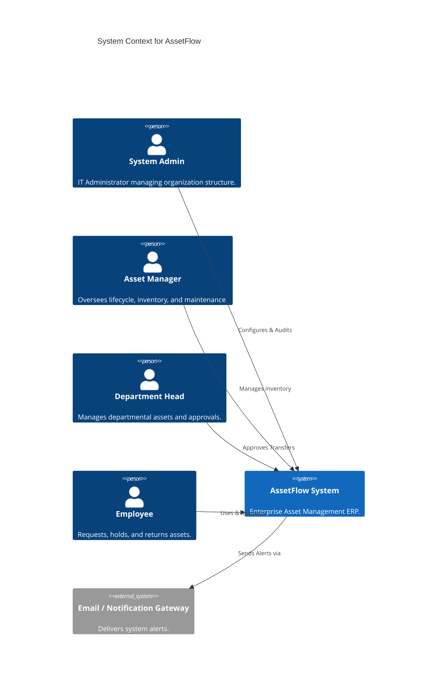
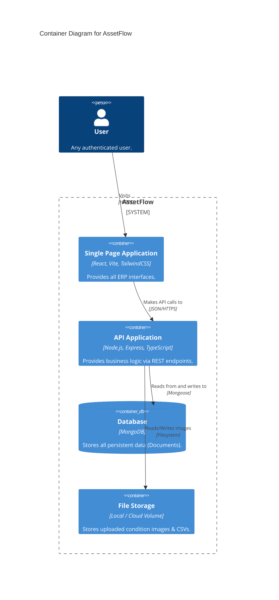
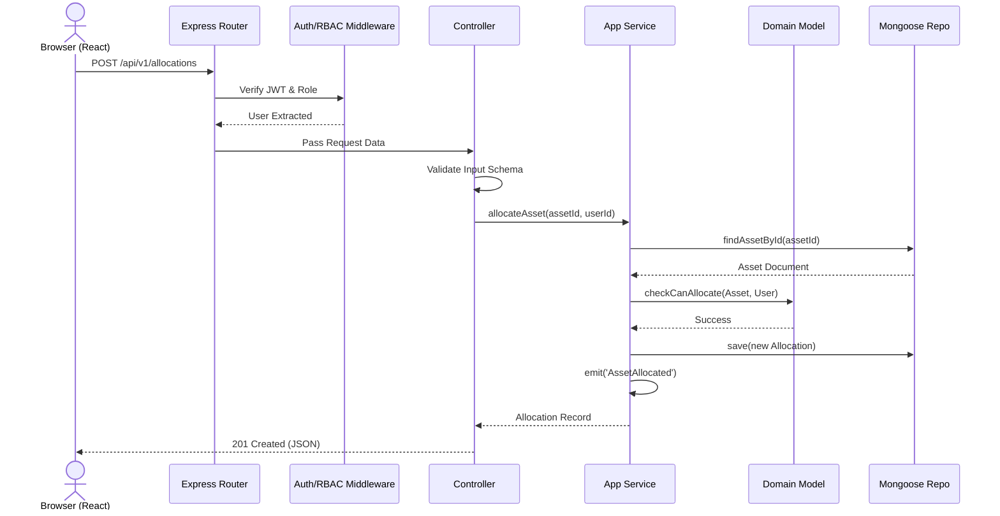
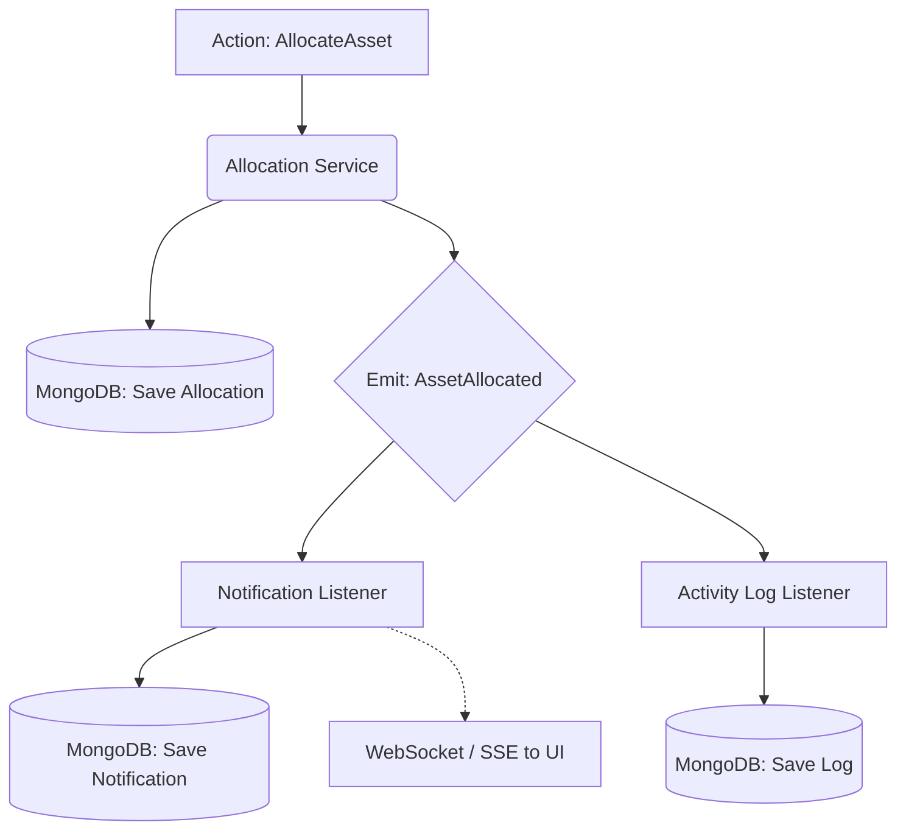

# 02. System Architecture

> **Version:** 1.0  
> **Status:** Draft — Pending Approval  
> **Source:** Derived strictly from `00_PRD.md` and `01_DOMAIN_MODEL.md`.

## 1. Executive Summary

The AssetFlow System Architecture provides a production-grade blueprint for developing a robust, maintainable, and scalable enterprise Asset Management system. Leveraging the MERN stack (MongoDB, Express.js, React, Node.js), this architecture adheres strictly to the boundaries and invariants defined in the Domain Model.

The architecture is designed to support the specific needs of an ERP-lite system: enforcing strict state machine transitions, providing an immutable audit trail of physical custody, and guaranteeing role-based data segregation. By adopting Domain-Driven Design (DDD) principles combined with a Layered Architecture, AssetFlow ensures that complex business logic (such as booking overlaps and custody transfers) is fully isolated from external infrastructural concerns like databases or HTTP transport.

## 2. Architectural Principles

1. **Single Responsibility Principle (SRP):** Every module, class, and function has a single reason to change. Ensures that UI modifications do not affect business logic.
2. **Separation of Concerns:** The system is divided into distinct layers (Presentation, Application, Domain, Infrastructure). Changes in the HTTP transport do not leak into the Domain logic.
3. **Layered Architecture:** Strict top-down dependencies. The Domain layer sits at the core and depends on nothing else, ensuring business rules are framework-agnostic.
4. **Domain-Driven Design (DDD):** The architecture mirrors the business language. Code components correspond 1:1 with business Bounded Contexts (Organization, Asset, Allocation).
5. **RESTful APIs:** Stateless, resource-oriented HTTP communication between the Frontend and Backend to ensure scalability and ease of integration.
6. **Event-Driven Domain Events:** Asynchronous propagation of side effects (e.g., Notifications, Activity Logs) triggered by core state mutations, ensuring the core request cycle remains fast.
7. **Dependency Inversion:** High-level policy modules do not depend on low-level detail modules. Both depend on abstractions (e.g., Repositories).
8. **Open/Closed Principle:** The architecture is open for extension (e.g., adding a new Notification channel) but closed for modification.
9. **Modularity:** High cohesion within bounded contexts and low coupling between them, preventing spaghetti code.
10. **Scalability:** Stateless backend services and stateless authentication (JWT) allow horizontal scaling across multiple instances.
11. **Maintainability:** Standardized repository structure and clear implementation constraints allow rapid onboarding of new engineers.
12. **Security First:** "Deny-by-default" RBAC, strict input sanitization, and secure JWT handling.
13. **Auditability:** Append-only history and immutable logs for all critical custody and state changes.

## 3. System Context (C4 Level 1)

This diagram shows the system in its environment, interacting with its users and external systems.



## 4. Container Architecture (C4 Level 2)

This diagram zooms into the AssetFlow System to show the high-level technical containers.



## 5. Component Architecture

### 5.1 Backend Modules

The Backend is divided vertically by Domain Context and horizontally by Layer:

* **Authentication:** Login, JWT generation, password resets, RBAC middleware.
* **Organization:** Departments, Employees, Roles, Asset Categories.
* **Assets:** Asset registry, lifecycle management, QR generation integration.
* **Allocation:** Assignment of assets, check-in, check-out, overdues.
* **Booking:** Shared resource reservations, conflict detection logic.
* **Maintenance:** Repair requests, status updates, technician assignment.
* **Audit:** Cycle management, discrepancy calculation, missing asset handling.
* **Reports:** Dashboard aggregations, CSV generation, KPI calculations.
* **Notifications:** Priority-based alert routing.
* **Activity Log:** Immutable system-wide history tracking.
* **Shared/Utilities:** Common error handlers, pagination helpers, validation middlewares.

*Dependencies:* Assets depend on Organization (Category). Allocation/Booking/Maintenance depend on Assets. Audit depends on Assets and Organization.

### 5.2 Frontend Modules

The React Frontend is structured to enforce reusability and clean state:

* **Pages (Views):** Container components mapping 1:1 with PRD Mockups (e.g., `DashboardPage`, `AssetRegistryPage`).
* **Components (UI):** Dumb, presentational components (shadcn/ui elements, buttons, data tables, modals).
* **Hooks:** Custom React hooks (`useAuth`, `useAssets`, `useNotifications`) encapsulating API fetching (e.g., using React Query/SWR).
* **Services:** Pure Axios/Fetch wrappers abstracting REST endpoints.
* **Context:** Global state providers (Authentication Context, Theme Context).
* **State:** Local component state (Zustand or React Context) for complex workflows like the Audit Checklist.

## 6. Layered Architecture

AssetFlow strictly enforces a 4-tier Layered Architecture on the backend:

1. **Presentation Layer (Controllers & Routes):** Handles HTTP requests, parses JSON, performs basic validation (e.g., Zod/Joi schema checks), and returns HTTP responses.
2. **Application Layer (Use Cases / Services):** Orchestrates domain logic, handles transactions, and triggers Domain Events.
3. **Domain Layer (Entities & Rules):** Pure TypeScript classes/interfaces containing the core business logic (e.g., State Machines, Invariants). Depends on NOTHING.
4. **Infrastructure Layer (Persistence & Adapters):** Mongoose models, external API integrations, email sending logic.

*Dependency Direction:* Presentation → Application → Domain ← Infrastructure (via Dependency Inversion).

## 7. Request Lifecycle

The following sequence details a typical HTTP request strictly adhering to the layers.



## 8. Authentication & Authorization

* **Mechanism:** Stateless JSON Web Tokens (JWT).
* **Lifecycle:** 
  1. User authenticates via `/api/v1/auth/login`.
  2. Server verifies password hash (bcrypt) and issues an Access Token (short-lived, e.g., 1 hour).
  3. Client stores token securely (memory or HttpOnly cookie, per implementation choice).
  4. Client attaches `Authorization: Bearer <token>` to all protected routes.
* **Role-Based Access Control (RBAC):** Middleware intercepts routes, extracts the role from the JWT payload, and asserts it against the allowed roles for the endpoint (enforcing the Role Permission Matrix).
* **Permission Checks:** Row-level security (e.g., "Can this Employee see this specific Allocation?") is enforced at the Service layer, injecting the User ID into database queries.

## 9. Event Flow

Domain Events decouple side effects from the primary business transaction to maintain low latency.



## 10. Cross-Cutting Concerns

* **Validation:** All incoming HTTP requests are validated against strict schemas (e.g., Zod) before reaching the controller.
* **Logging:** Centralized structured logging (e.g., Winston/Pino) for all API requests and errors.
* **Audit Logging:** The `Activity Log` entity captures critical mutations with `userId`, `timestamp`, `action`, and `targetId`.
* **Error Handling:** A global Express error handler catches all exceptions and formats them into a standard JSON response (`{ success: false, error: { code, message } }`).
* **Exception Strategy:** Services throw custom Domain Exceptions (e.g., `AssetUnavailableError`) which the controller catches and maps to HTTP 400/409.
* **Configuration:** 12-Factor App methodology. All configuration via Environment Variables (`.env`), validated on startup.

## 11. Architecture Decision Records (ADR)

### ADR 1: MERN Stack Selection
* **Context:** Need a fast-to-develop, unified language stack for an ERP system.
* **Decision:** React for frontend, Node/Express for backend, MongoDB for data.
* **Consequences:** TypeScript can be shared across both. Express provides lightweight routing.

### ADR 2: MongoDB Document Database
* **Context:** Asset schemas may require flexible custom fields (Asset Categories) and heavy read-aggregation (Dashboards).
* **Decision:** Use MongoDB and Mongoose.
* **Alternatives:** PostgreSQL (rejected due to rigid schema for custom asset properties).
* **Consequences:** Must enforce referential integrity manually in the Application layer, as MongoDB lacks strict foreign keys.

### ADR 3: JWT for Authentication
* **Context:** Need scalable, stateless authentication.
* **Decision:** Use JWT over server-side session stores.
* **Consequences:** Revoking access instantly is harder (requires token blacklisting or short expiries).

### ADR 4: Append-Only History
* **Context:** Auditing physical custody is a critical ERP requirement.
* **Decision:** Allocation, Maintenance, and Audit records are never updated or deleted once closed. New records are appended.
* **Consequences:** Storage grows over time. Querying the "current" state requires finding the most recent record or caching it on the Asset aggregate.

### ADR 5: Domain-Driven Design (DDD)
* **Context:** The system has complex rules (Booking overlaps, transitions).
* **Decision:** Isolate business logic into a pure Domain layer.
* **Consequences:** Higher initial boilerplate, but massive reduction in maintenance cost and regression bugs.

## 12. Security Architecture

* **Authentication:** Enforced globally. No unauthenticated access except `/login`.
* **Authorization:** Strict RBAC.
* **Password Hashing:** `bcrypt` with a high work factor (salt rounds >= 10).
* **Injection Protection:** Mongoose inherently sanitizes against standard SQL injections. We strictly validate object shapes to prevent NoSQL `$where` injections.
* **XSS Protection:** React automatically escapes values in JSX.
* **CSRF:** If using tokens in LocalStorage, API relies on CORS restrictions. If using HttpOnly cookies, CSRF tokens are required.

## 13. Performance Architecture

* **Pagination:** All list endpoints (Assets, Allocations, Logs) mandate offset/limit or cursor-based pagination.
* **Indexes:** Strategic MongoDB indexes applied on `assetTag`, `email`, `status`, and foreign keys (`assignedTo`, `departmentId`) to ensure `O(log N)` reads.
* **Concurrency:** Booking conflicts handled via database-level atomic checks or locking mechanisms in Mongoose.

## 14. Fault Tolerance

* **Graceful Degradation:** If the Notification service fails, the core Allocation transaction must still succeed (Notifications are best-effort).
* **Global Error Catcher:** Prevents the Node.js process from crashing on unhandled promise rejections.

## 15. Scalability Strategy

* **Stateless Backend:** The Node/Express server stores zero local state. Any request can hit any backend instance.
* **Database Scaling:** MongoDB can be horizontally sharded if data grows beyond a single replica set.

## 16. Repository Structure

```text
/
├── frontend/                 # React SPA
│   ├── src/
│   │   ├── components/       # Reusable UI (shadcn)
│   │   ├── pages/            # View Containers
│   │   ├── hooks/            # Custom API Hooks
│   │   ├── services/         # API Clients
│   │   ├── context/          # Global State
│   │   └── utils/            # Helpers
├── backend/                  # Node.js API
│   ├── src/
│   │   ├── controllers/      # HTTP layer
│   │   ├── services/         # Application logic
│   │   ├── models/           # Mongoose schemas (Infra)
│   │   ├── domain/           # Pure business rules & types
│   │   ├── routes/           # Express routers
│   │   └── middlewares/      # Auth, Error handlers
├── shared/                   # Shared TypeScript interfaces
├── docs/                     # Architectural & PRD docs
└── scripts/                  # DB seeders, deployment scripts
```

## 17. Implementation Constraints

To maintain architectural integrity, developers MUST adhere to the following rules:

1. **Controllers NEVER contain business logic.** They only handle HTTP parsing, validation, and invoking services.
2. **Services NEVER return HTTP responses.** They return data objects. The controller maps these to HTTP status codes.
3. **Mongoose Models NEVER enforce complex business rules.** They only enforce data types and simple database constraints (uniqueness).
4. **The Domain Layer NEVER imports Express or Mongoose.** It must remain entirely agnostic of frameworks.
5. **No Hard Deletes.** Records are marked as inactive/retired.

## 18. Document Traceability

This System Architecture dictates the subsequent generation of:

* **`03_DATABASE.md`**: Implements the Infrastructure Layer defined here (MongoDB collections, indexes derived from Section 13).
* **`04_API.md`**: Defines the Presentation Layer contracts (REST routes, payloads, HTTP codes derived from Section 7).
* **`05_RBAC.md`**: Formalizes the Authorization middleware rules (Section 8).
* **`06_FRONTEND_ARCHITECTURE.md`**: Expands Section 5.2 into a full React component hierarchy.
* **`07_BACKEND_ARCHITECTURE.md`**: Expands Section 5.1 and Section 16 into detailed code-level service definitions.
* **`08_IMPLEMENTATION_PLAN.md` & `09_TASKS.md`**: Derives task sequences based on Layered architecture (e.g., Build Database → Build Services → Build API → Build UI).

---

*End of Document. Awaiting approval to proceed to `03_DATABASE.md`.*
