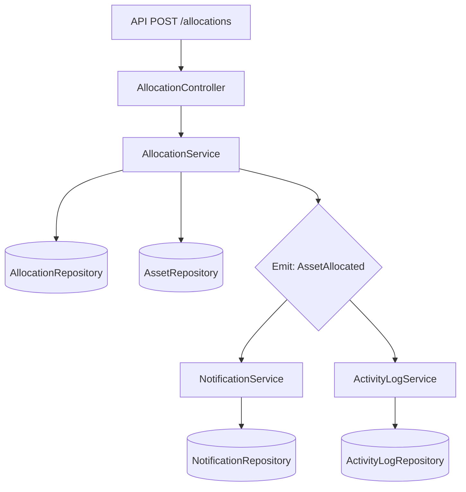
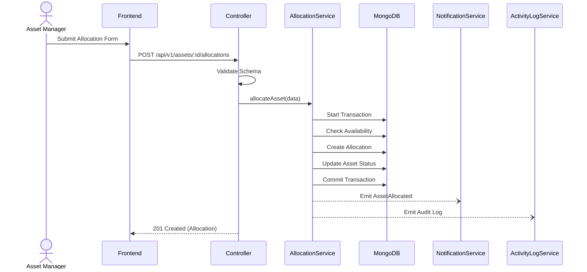
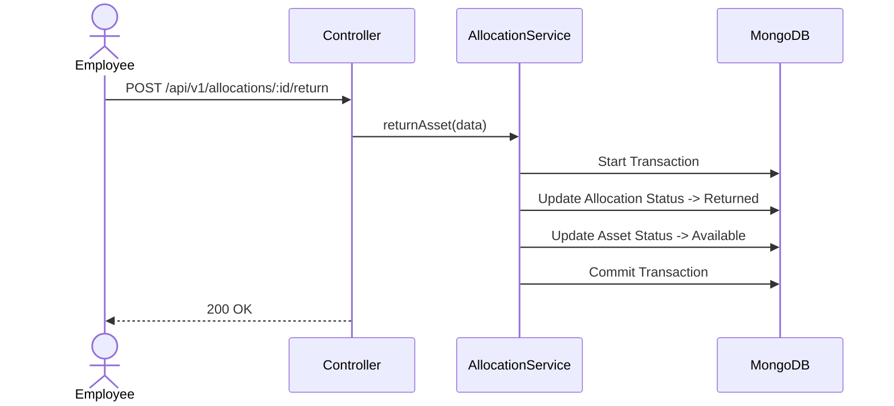
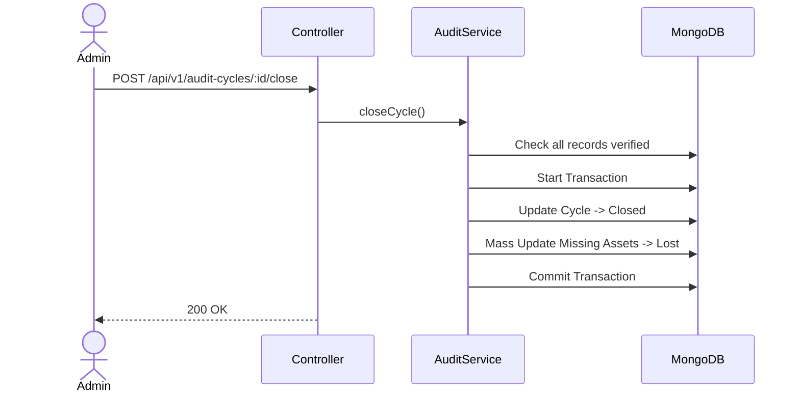

# 04. API Specification

> **Version:** 1.1  
> **Status:** Draft — Pending Approval  
> **Source:** Derived strictly from `00_PRD.md`, `01_DOMAIN_MODEL.md`, `02_SYSTEM_ARCHITECTURE.md`, and `03_DATABASE.md`.

## 1. API Philosophy

The AssetFlow API contract is strictly **Business-Driven**, rather than purely CRUD-driven. 
* **Why REST:** It provides a universally understood, resource-oriented semantic model that maps well to our Domain Aggregates while maintaining statelessness for horizontal scalability.
* **Why Resource-Oriented:** Resources like `/assets` and `/allocations` provide clear URL predictability mapping directly to backend Repositories.
* **Why Command-Driven Workflows:** Business rules govern state transitions. A simple `PUT /assets/:id` is insufficient for allocating an asset. Instead, explicit actions like `POST /assets/:id/allocations` capture the exact domain command intent (e.g., `AllocateAsset`), ensuring all side effects and invariants are triggered.
* **Why Stateless APIs:** Session state is offloaded to the client (via JWT), allowing any API replica to serve any request, ensuring high availability.
* **Why Versioning:** Prefixing endpoints with `/api/v1` protects the frontend from breaking changes during future iterations.
* **Why Consistent Contracts:** Utilizing uniform response envelopes ensures frontend developers can rely on a single HTTP client interceptor for success/error handling without guessing payload structures.

## 2. API Standards

* **Versioning:** All endpoints prefix with `/api/v1/`.
* **Naming Conventions:** Resources are lowercase, plural nouns (e.g., `/assets`, `/maintenance-requests`). Actions use sub-resources or explicit verbs where appropriate.
* **HTTP Methods:**
  * `GET`: Safe reads (Queries).
  * `POST`: Unsafe creates or business commands.
  * `PUT`/`PATCH`: Safe updates of mutable fields.
  * `DELETE`: Logical deletion (Archival/Disposal).
* **Status Codes:**
  * `200 OK`: Success (Read, Update, Command).
  * `201 Created`: Resource successfully generated.
  * `400 Bad Request`: Validation failure.
  * `401 Unauthorized`: Missing/invalid JWT.
  * `403 Forbidden`: RBAC violation.
  * `404 Not Found`: Resource missing.
  * `409 Conflict`: Business invariant failure (e.g., Booking Overlap).
* **Headers:** `Authorization: Bearer <token>`, `Content-Type: application/json`.
* **Pagination:** Standard query params `?page=1&limit=50`. Returns `meta` object with total counts.
* **Filtering & Sorting:** `?status=Active&sort=-createdAt`.
* **Date Formats:** ISO 8601 (e.g., `2026-07-12T10:00:00Z`).
* **Response Envelope:** `{ "success": true, "data": { ... }, "meta": { ... } }`.
* **Error Envelope:** `{ "success": false, "error": { "code": "...", "message": "..." } }`.
* **Idempotency:** Required on retryable commands (e.g., `POST` with a unique transaction key in the header).

---

## 3. Command APIs

Every Domain Command from `01_DOMAIN_MODEL.md` maps directly to an API endpoint.

### 3.1 Register Asset
* **Business Capability:** Adds a new physical asset to the system.
* **Domain Command:** `RegisterAsset`
* **HTTP Method:** `POST`
* **Endpoint:** `/api/v1/assets`
* **Authentication Required:** Yes
* **RBAC Roles:** Admin, Asset Manager
* **Request Body:** `{ assetTag, name, categoryId, departmentId, condition, serialNumber?, location? }`
* **Validation Rules:** `assetTag` required, `categoryId` valid.
* **Preconditions:** None.
* **Business Rules:** Cannot use existing `assetTag`.
* **Transaction Boundary:** Asset.
* **Repositories Used:** AssetRepository.
* **Database Collections:** `assets`.
* **Domain Events Generated:** `AssetRegistered`.
* **Notifications Generated:** None.
* **Audit Log Entries:** `ASSET_REGISTERED`.
* **Success Response:** `201 Created`, Asset object.
* **Possible Errors:** `409 DuplicateAssetTag`.
* **Idempotency Rules:** Handled via unique `assetTag`.

### 3.2 Allocate Asset
* **Business Capability:** Assigns custody of an asset to an employee/department.
* **Domain Command:** `AllocateAsset`
* **HTTP Method:** `POST`
* **Endpoint:** `/api/v1/assets/:assetId/allocations`
* **Authentication Required:** Yes
* **RBAC Roles:** Asset Manager, Admin
* **Request Body:** `{ assignedToId, expectedReturnDate }`
* **Preconditions:** Asset exists. Target exists.
* **Business Rules:** Asset must be 'Available'. Target must be active.
* **Transaction Boundary:** Asset, Allocation.
* **Repositories Used:** AssetRepository, AllocationRepository.
* **Database Collections:** `assets`, `allocations`.
* **Domain Events Generated:** `AssetAllocated`.
* **Notifications Generated:** To Assignee.
* **Audit Log Entries:** `ASSET_ALLOCATED`.
* **Success Response:** `201 Created`, Allocation object.
* **Possible Errors:** `409 AssetAlreadyAllocated`.
* **Idempotency Rules:** Reject identical `assetId` + `assignedToId` if currently Active.

### 3.3 Return Asset
* **Business Capability:** Checks in an allocated asset.
* **Domain Command:** `ReturnAsset`
* **HTTP Method:** `POST`
* **Endpoint:** `/api/v1/allocations/:id/return`
* **Authentication Required:** Yes
* **RBAC Roles:** Employee (Self), Asset Manager, Admin
* **Request Body:** `{ checkinNotes, condition }`
* **Preconditions:** Allocation is 'Active'.
* **Business Rules:** Update Allocation to 'Returned', Asset to 'Available'. Cancel pending transfers.
* **Transaction Boundary:** Asset, Allocation, TransferRequest.
* **Repositories Used:** AllocationRepository, AssetRepository.
* **Database Collections:** `allocations`, `assets`, `transferRequests`.
* **Domain Events Generated:** `AssetReturned`.
* **Notifications Generated:** To Asset Manager (if conditions note damage).
* **Audit Log Entries:** `ASSET_RETURNED`.
* **Success Response:** `200 OK`.

### 3.4 Create Transfer Request
* **Business Capability:** Request custody from current holder.
* **Domain Command:** `CreateTransferRequest`
* **HTTP Method:** `POST`
* **Endpoint:** `/api/v1/transfer-requests`
* **RBAC Roles:** Employee, Dept Head
* **Request Body:** `{ assetId, targetEmployeeId, reason }`
* **Preconditions:** Asset is currently 'Allocated'.
* **Business Rules:** Cannot request transfer for available assets.

### 3.5 Approve Transfer
* **Business Capability:** Finalize custody handover.
* **Domain Command:** `ApproveTransfer`
* **HTTP Method:** `POST`
* **Endpoint:** `/api/v1/transfer-requests/:id/approve`
* **RBAC Roles:** Asset Manager, Dept Head
* **Request Body:** None
* **Business Rules:** Close old allocation, open new allocation.

### 3.6 Book Resource
* **Business Capability:** Reserve a shared asset.
* **Domain Command:** `BookResource`
* **HTTP Method:** `POST`
* **Endpoint:** `/api/v1/bookings`
* **RBAC Roles:** Employee, Dept Head, Asset Manager, Admin
* **Request Body:** `{ assetId, startDate, endDate }`
* **Preconditions:** Asset is bookable.
* **Business Rules:** No overlapping time slots.
* **Possible Errors:** `409 BookingConflict`.

### 3.7 Cancel Booking
* **Business Capability:** Free up a booked slot.
* **Domain Command:** `CancelBooking`
* **HTTP Method:** `POST`
* **Endpoint:** `/api/v1/bookings/:id/cancel`
* **RBAC Roles:** Booker (Self), Asset Manager, Admin

### 3.8 Raise Maintenance Request
* **Business Capability:** Report issue.
* **Domain Command:** `RaiseMaintenanceRequest`
* **HTTP Method:** `POST`
* **Endpoint:** `/api/v1/maintenance-requests`
* **RBAC Roles:** Any
* **Request Body:** `{ assetId, issueDescription, priority }`

### 3.9 Approve Maintenance
* **Business Capability:** Gate repair work.
* **Domain Command:** `ApproveMaintenance`
* **HTTP Method:** `POST`
* **Endpoint:** `/api/v1/maintenance-requests/:id/approve`
* **RBAC Roles:** Asset Manager
* **Business Rules:** Transition asset to 'Under Maintenance'.

### 3.10 Resolve Maintenance
* **Business Capability:** Complete repair.
* **Domain Command:** `ResolveMaintenance`
* **HTTP Method:** `POST`
* **Endpoint:** `/api/v1/maintenance-requests/:id/resolve`
* **RBAC Roles:** Asset Manager
* **Request Body:** `{ resolutionNotes, newCondition }`
* **Business Rules:** Revert asset to previous status.

### 3.11 Create Audit Cycle
* **Business Capability:** Start verification.
* **Domain Command:** `CreateAuditCycle`
* **HTTP Method:** `POST`
* **Endpoint:** `/api/v1/audit-cycles`
* **RBAC Roles:** Admin
* **Request Body:** `{ departmentId, startDate, endDate }`

### 3.12 Close Audit Cycle
* **Business Capability:** Finalize discrepancies.
* **Domain Command:** `CloseAuditCycle`
* **HTTP Method:** `POST`
* **Endpoint:** `/api/v1/audit-cycles/:id/close`
* **RBAC Roles:** Admin
* **Business Rules:** All records must be verified. Missing assets marked 'Lost'.

### 3.13 Create Department
* **Domain Command:** `CreateDepartment`
* **Endpoint:** `POST /api/v1/departments`
* **RBAC:** Admin

### 3.14 Deactivate Department
* **Domain Command:** `DeactivateDepartment`
* **Endpoint:** `POST /api/v1/departments/:id/deactivate`
* **RBAC:** Admin

### 3.15 Create Employee
* **Domain Command:** `CreateEmployee`
* **Endpoint:** `POST /api/v1/employees`
* **RBAC:** Admin

### 3.16 Promote Employee
* **Domain Command:** `PromoteEmployee`
* **Endpoint:** `POST /api/v1/employees/:id/role`
* **RBAC:** Admin
* **Business Rules:** Updates role; revokes active sessions.

### 3.17 Retire / Dispose Asset
* **Domain Commands:** `RetireAsset`, `DisposeAsset`
* **Endpoint:** `POST /api/v1/assets/:id/status`
* **Request Body:** `{ newStatus: "Retired" | "Disposed" }`
* **RBAC:** Asset Manager, Admin

---

## 4. Query APIs

### 4.1 List Assets
* **Purpose:** Asset registry view.
* **HTTP Method:** `GET`
* **Endpoint:** `/api/v1/assets`
* **RBAC:** Any
* **Query Parameters:** `?status=Available&categoryId=123&search=laptop`
* **Pagination:** Yes.

### 4.2 Get Asset Details
* **Endpoint:** `GET /api/v1/assets/:id`

### 4.3 Find Overdue Allocations
* **Purpose:** Dashboard alert feed.
* **Endpoint:** `GET /api/v1/allocations?status=Active&isOverdue=true`

### 4.4 Booking Calendar
* **Purpose:** Time slot rendering.
* **Endpoint:** `GET /api/v1/bookings?assetId=xyz&startDate_gte=2026-07-01`

### 4.5 Maintenance Queue
* **Endpoint:** `GET /api/v1/maintenance-requests?status=Pending`

### 4.6 Dashboard KPIs
* **Purpose:** Top-level metrics.
* **Endpoint:** `GET /api/v1/reports/kpis`
* **Performance:** Cached or pre-computed.

### 4.7 Audit Dashboard
* **Endpoint:** `GET /api/v1/audit-cycles/:id/records`

### 4.8 Activity Log
* **Endpoint:** `GET /api/v1/activity-logs?targetId=xyz`

### 4.9 Employee / Department Directory
* **Endpoint:** `GET /api/v1/employees`, `GET /api/v1/departments`

---

## 5. Authentication APIs

* **Login:** `POST /api/v1/auth/login` (Body: `{ email, password }`, Returns: `{ token }`)
* **Logout:** `POST /api/v1/auth/logout` (Client-side token purge)
* **Refresh Token:** `POST /api/v1/auth/refresh`
* **Forgot Password:** `POST /api/v1/auth/forgot-password` (Issues short-lived token)
* **Reset Password:** `POST /api/v1/auth/reset-password` (Consumes token)
* **Profile:** `GET /api/v1/auth/me` (Returns current user from JWT)
* **Session Validation:** Ensured globally by JWT expiry and signature checks.

---

## 6. Common Response Contracts

**Success Response (200/201):**
```json
{
  "success": true,
  "data": { "id": "123", "status": "Active" },
  "meta": { "total": 1, "page": 1 }
}
```

**Error Response (4xx/5xx):**
```json
{
  "success": false,
  "error": {
    "code": "BookingConflict",
    "message": "The selected time slot overlaps with an existing booking."
  }
}
```

---

## 7. Error Catalog

| Error Code | HTTP Code | Business Meaning | Recovery Strategy |
|------------|-----------|------------------|-------------------|
| `AssetAlreadyAllocated` | 409 | Asset has active custody. | Request transfer instead. |
| `BookingConflict` | 409 | Time slot overlap. | Select a different slot. |
| `InvalidLifecycleTransition` | 400 | Disposed asset altered. | Reject operation permanently. |
| `DuplicateAssetTag` | 409 | Asset Tag collision. | Append suffix to tag. |
| `PermissionDenied` | 403 | Missing RBAC privileges. | Ask Admin for promotion. |
| `AuditAlreadyClosed` | 400 | Modifying locked cycle. | View-only mode. |

---

## 8. Event Mapping



---

## 9. API Security

* **JWT:** Standard bearer tokens passed in headers.
* **RBAC:** Defined securely in `05_RBAC.md`. Enforced via Express middleware on every route.
* **Permission Checks:** Row-level ownership verified in Services (e.g., modifying a return condition requires being the assignee or an Asset Manager).
* **Input Validation:** Zod/Joi schemas on request bodies before Controllers process them.
* **Rate Limiting:** Protects `/login` and `/forgot-password` endpoints.
* **Input Sanitization:** Reject `$`, `.`, and operators in body to prevent NoSQL injection.

---

## 10. Performance

* **Pagination:** Enforced strictly (`limit` defaults to 20, max 100) on all `GET` lists.
* **Filtering & Search:** Passed down to Mongoose indexes. Full-text search routed via MongoDB `$text`.
* **Response Size:** APIs exclude bloated nested relationships unless specifically requested (e.g., using `?include=department`).

---

## 11. Implementation Rules

Developers MUST follow these invariants:
1. **Controllers never contain business logic.**
2. **Services own workflows** and trigger transactions.
3. **Repositories own persistence.**
4. **Commands mutate state** (`POST/PUT/DELETE`).
5. **Queries never mutate state** (`GET`).
6. **Domain Events never return HTTP responses** (They run async).
7. **Never bypass RBAC middleware.**
8. **Never bypass Zod/Joi input validation.**

---

## 12. Traceability

| PRD Workflow | Domain Command | Database Collections | Repositories | Frontend Screen |
|--------------|----------------|----------------------|--------------|-----------------|
| Booking Workflow (9) | `BookResource` | `bookings` | BookingRepo | Screen 6 & 7 |
| Allocation (10) | `AllocateAsset` | `allocations`, `assets`| AllocRepo, AssetRepo | Screen 5 |
| Transfer (11) | `ApproveTransfer`| `transferRequests` | AllocRepo, TransferRepo| Screen 5 |
| Maintenance (12) | `ApproveMaintenance`| `maintenanceReq`, `assets`| MaintRepo, AssetRepo | Dashboard (Screen 2) |
| Audit Workflow (13)| `CloseAuditCycle` | `auditCycles`, `auditRec`| AuditRepo | Screen 8 |

---

## 13. Verification Checklist

* [x] Every PRD workflow has an API (`/bookings`, `/allocations`, `/maintenance-requests`, `/audit-cycles`, `/transfer-requests`).
* [x] Every Domain Command has an endpoint (Detailed in Section 3).
* [x] Every Query has an endpoint (Detailed in Section 4).
* [x] Every endpoint has RBAC (Defined per route).
* [x] Every endpoint maps to repositories (Abstracted through Services).
* [x] Every endpoint maps to collections (Defined).
* [x] Every endpoint generates correct events.
* [x] Every endpoint follows architecture (Layered separation).

No missing mappings detected.

## 14. Master Endpoint Catalog

This catalog serves as the primary reference for all backend developers implementing routes and frontend developers consuming them.

| Business Capability | Method | Endpoint | Auth | RBAC Roles | Command / Query | Transaction | Notifications | Audit Log |
|---------------------|--------|----------|------|------------|-----------------|-------------|---------------|-----------|
| Register Asset | POST | `/api/v1/assets` | Yes | Admin, Asset Mgr | `RegisterAsset` | No | No | Yes |
| Allocate Asset | POST | `/api/v1/assets/:assetId/allocations` | Yes | Asset Mgr, Admin | `AllocateAsset` | Yes | Yes | Yes |
| Return Asset | POST | `/api/v1/allocations/:id/return` | Yes | Employee, Asset Mgr | `ReturnAsset` | Yes | Yes | Yes |
| Request Transfer | POST | `/api/v1/transfer-requests` | Yes | Employee, Dept Head | `CreateTransferRequest` | No | Yes | No |
| Approve Transfer | POST | `/api/v1/transfer-requests/:id/approve` | Yes | Asset Mgr, Dept Head | `ApproveTransfer` | Yes | Yes | Yes |
| Book Resource | POST | `/api/v1/bookings` | Yes | Any | `BookResource` | No | Yes | No |
| Cancel Booking | POST | `/api/v1/bookings/:id/cancel` | Yes | Booker, Asset Mgr | `CancelBooking` | No | Yes | No |
| Raise Maintenance | POST | `/api/v1/maintenance-requests` | Yes | Any | `RaiseMaintenanceRequest` | No | Yes | No |
| Approve Maintenance | POST | `/api/v1/maintenance-requests/:id/approve` | Yes | Asset Mgr | `ApproveMaintenance` | Yes | Yes | Yes |
| Resolve Maintenance | POST | `/api/v1/maintenance-requests/:id/resolve` | Yes | Asset Mgr | `ResolveMaintenance` | Yes | Yes | Yes |
| Create Audit Cycle | POST | `/api/v1/audit-cycles` | Yes | Admin | `CreateAuditCycle` | Yes | No | Yes |
| Close Audit Cycle | POST | `/api/v1/audit-cycles/:id/close` | Yes | Admin | `CloseAuditCycle` | Yes | Yes | Yes |
| Promote Employee | POST | `/api/v1/employees/:id/role` | Yes | Admin | `PromoteEmployee` | No | No | Yes |
| List Assets | GET | `/api/v1/assets` | Yes | Any | `ListAssets` | No | No | No |
| Find Overdue | GET | `/api/v1/allocations` | Yes | Admin, Asset Mgr | `FindOverdueAllocations` | No | No | No |
| Booking Calendar | GET | `/api/v1/bookings` | Yes | Any | `BookingCalendar` | No | No | No |
| Dashboard KPIs | GET | `/api/v1/reports/kpis` | Yes | Admin, Asset Mgr | `DashboardKPIs` | No | No | No |

## 15. Request / Response Contracts

Conceptual DTOs defining the mandatory and optional payloads for critical workflows, remaining language-agnostic.

### `RegisterAssetRequest`
* **Purpose:** Payload for creating a new asset.
* **Mandatory Fields:** `assetTag`, `name`, `categoryId`, `departmentId`, `condition`.
* **Optional Fields:** `serialNumber`, `location`, `acquisitionDate`, `acquisitionCost`.
* **Validation Expectations:** `assetTag` matches pattern. Strings not empty.
* **Related Command:** `RegisterAsset`

### `AllocateAssetRequest`
* **Purpose:** Payload to assign custody.
* **Mandatory Fields:** `assignedToId`, `expectedReturnDate`.
* **Optional Fields:** `checkoutNotes`.
* **Validation Expectations:** Date must be in the future. IDs must be valid format.
* **Related Command:** `AllocateAsset`

### `AssetResponse`
* **Purpose:** Canonical representation of an asset returned in single or list views.
* **Returned Fields:** `id`, `assetTag`, `name`, `status`, `condition`, `category`, `department`, `createdAt`, `updatedAt`.
* **Related Queries:** `ListAssets`, `GetAssetDetails`

### `BookingRequest`
* **Purpose:** Payload to reserve time.
* **Mandatory Fields:** `assetId`, `startDate`, `endDate`.
* **Optional Fields:** `purpose`.
* **Validation Expectations:** `startDate` < `endDate`. Both in the future.
* **Related Command:** `BookResource`

### `DashboardResponse`
* **Purpose:** Aggregated metrics for the top-level view.
* **Returned Fields:** `totalAssets`, `activeAllocations`, `overdueAllocations`, `pendingMaintenance`, `missingAssets`.
* **Related Queries:** `DashboardKPIs`

## 16. Business Workflow Sequence Diagrams

### 16.1 Asset Allocation



### 16.2 Asset Return



### 16.3 Audit Closure



## 17. Idempotency Strategy

* **Which endpoints require idempotency keys:** All `POST` commands that result in non-reversible side effects (e.g., `POST /assets/:id/allocations`, `POST /bookings`).
* **Naturally idempotent commands:** `PUT` and `PATCH` requests (if implemented), and status toggles where the target status is explicit.
* **Retry behavior:** If the API receives a duplicate `Idempotency-Key` header within 24 hours, it returns the cached `201 Created` or `200 OK` response without executing the service logic again.
* **Conflict detection:** Prevents a double-click on the frontend from accidentally creating two identical allocations for the same user.
* **Business rationale:** High reliability over poor networks; ensures we never double-charge or double-allocate resources.

## 18. Standard Pagination Contract

All paginated `GET` endpoints will strictly adhere to the following JSON structure to allow a single unified frontend table component to parse all lists.

```json
{
  "success": true,
  "data": [
    { /* Array of items */ }
  ],
  "meta": {
    "page": 1,
    "limit": 50,
    "total": 1240,
    "pages": 25,
    "hasNext": true,
    "hasPrevious": false
  }
}
```

## 19. API Conventions

These global rules are mandatory across the entire repository to guarantee cross-team predictability.

* **JSON Naming:** `camelCase` exclusively for all request bodies and response payloads.
* **Timestamps:** ISO8601 strings in UTC timezone only (e.g., `2026-07-12T10:00:00Z`). Frontend handles localized formatting.
* **Boolean Naming:** Prefixed with `is`, `has`, or `can` (e.g., `isOverdue`).
* **Enum Serialization:** Always serialized as `PascalCase` strings (e.g., `"UnderMaintenance"`), never as integers.
* **Null Handling:** If an optional field is unset, it should return `null`, not be omitted from the response object.
* **Identifier Naming:** Use `id` in the response payloads, abstracting away MongoDB's internal `_id`. Foreign keys append `Id` (e.g., `departmentId`).
* **Consistent Error Codes:** Use PascalCase strings for programmatic error handling (e.g., `BookingConflict`), decoupled from HTTP status codes.

*Why these are mandatory:* Reduces cognitive load, eliminates boilerplate mapping code in the frontend, prevents timezone bugs, and ensures the API acts as a cohesive product rather than a disjointed set of routes.

---

*End of Document. Awaiting approval to proceed to `05_RBAC.md`.*
